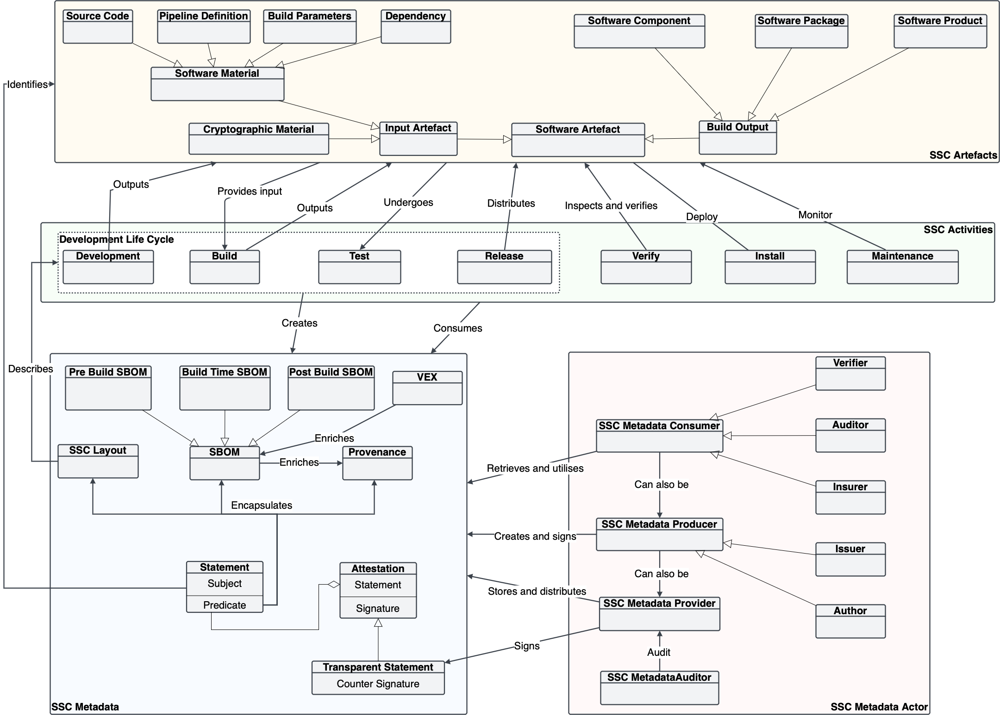

Recent years have witnessed a meteoric rise in Software Supply Chain (SSC) attacks. The [8th Annual State of the Software Supply Chain Report by Sonatype](https://www.sonatype.com/press-releases/2022-software-supply-chain-report) reported a 742% annual increase in SSC attacks since 2019. 

An SSC attack involves a two-pronged approach: an upstream attack, where malicious code infiltrates a software artifact through a compromised step in its development process, and a downstream attack, targeting the users of that artifact. The absence of adequate oversight during the artifact's lifecycle creates opportunities for upstream attacks, while a lack of visibility into how artifacts are distributed and used leaves room for downstream vulnerabilities. Thus, safeguarding software assets necessitates comprehensive and dependable monitoring of the entire Software Supply Chain (SSC). This oversight allows for the early detection of upstream risks, such as changes in a project's maintainer, and enables the swift identification of vulnerable assets in the event of an upstream attack.

The solution to the visibility challenge in SSC may lie in the form of concise documents known as SSC metadata. You may have encountered them in various forms: Software Bill of Material (SBOM), Software Provenance, and Software Attestation. In this article series, we will delve into what SSC metadata entails and explore how to establish a suite of software tools to manage them effectively. In this first part, we will talk about what SSC metadata and how it can help you. 

The content presented here draws from recent research conducted by myself and colleagues at CREST. For more comprehensive information and details regarding the methodology, please refer to the preprint associated with this work.

# What can you do with SSC metadata?

Before we delve into the intricacies of SSC metadata, let's first explore how it can enhance the security of your software inventory.

**Vulnerability Detection:** Picture this scenario: you manage a fleet of containers running on multiple Kubernetes clusters. Today, you woke up to news about a compromised software component that could potentially allow remote code execution. Your immediate concern is, "Do any of my containers contain this vulnerable component?" If your containers come with Software Bill of Materials (SBOMs), ideally provided by the software provider rather than reverse-engineered by you, you can swiftly obtain the answer. These SBOMs essentially serve as machine-readable "ingredient labels" for your containers.

**Artifact Verification:** How can you be certain that a software artifact you've just obtained, whether it's a software container or a new Python package, is authentic? In this context, authenticity means the artifact was built and distributed precisely according to the intentions of the artifact provider/owner and hasn't been tampered with along the way. Even if you use HTTPS for communication with distribution repositories (e.g., Docker Hub, PyPI) and verify MD5 digests for incoming artifacts, you cannot completely safeguard against situations where the artifact in the repository itself has been compromised or replaced.

This is where SSC metadata, particularly software attestations, can provide a solution. An attestation can be thought of as a statement about an artifact made by the software producer. For instance, the statement might confirm that an artifact identified by a specific MD5 digest has been correctly built from the source code located in a particular Git repository. This statement is digitally signed by the software producer and may even be countersigned by an authority for additional security. When you receive an artifact, you can rely on the signatures and the content of the software attestations to perform additional verification that wasn't possible before.

Now, let's revisit the attack scenario mentioned earlier. Assuming that the artifact producer uses software attestations, and you have their public key, what options does an attacker have if they want to tamper with the artifact in the distribution repository?
- They could omit the attestation. However, you would immediately notice that something is amiss if the attestation is missing.
- They might replace the artifact while retaining the attestation. Nevertheless, the cryptographic digest of the artifact would not match the attestation, signaling that something is awry.
- They could attempt to modify the attestation. However, any tampering would be detectable because the digital signature of the attestation would no longer match.
- Assuming that the signing key of the artifact producer remains secure, an attacker cannot generate a valid attestation that deceives you into accepting the compromised artifact.

**SSC Risk Monitoring:** If you're looking to take a more proactive approach to SSC security by monitoring the "ingredients" used in your software assets to detect early signs of risks (e.g., sudden changes in project maintainers), SBOMs can provide a definitive and unambiguous list of ingredients for your monitoring efforts.

Moreover, with the assistance of another type of SSC metadata known as software provenance, you gain access to information about how these ingredients were developed, built, and distributed. These details can open up new avenues for detection. For example, imagine a group of GitHub contributors is identified as malicious. With access to provenance data, you can determine whether they have contributed to your software assets or any ingredients used by your assets.

# What is SSC Metadata?

In simpler terms, SSC metadata is like a detailed information card about a piece of software. This info can be automatically gathered from tools like GitHub or manually provided in files like "package.json" for NodeJS packages. However, these types of data often comes in different formats and lacks proper security, making it tricky for other software tools to use it for SSC visibility and security. That's why there's a need for a new kind of metadata that's formal, easy for computers to understand, and secure. This article focuses on this new type of metadata.

To understand SSC metadata better, let's break it down into parts. The following concept map shows different SSC metadata concepts and how they relate to the bigger picture of SSC. 

At the heart of SSC metadata, there are **statements** that describe various aspects of software components:
- **Software Bill of Material (SBOM)** is a detailed list of what's inside a software package or product. Think of it as an inventory. SBOM can be written according to a standard like SPDX, CycloneDX, or SWID, so that different software tools can understand. Some organizations, like the US National Telecommunications and Information Administration (NTIA), have produced guidelines for what info should be in an SBOM.
- **Provenance** tells you how a piece of software was made. It can be considered a claim that some entity created the software  by following some specific instructions. 
- **SSC Layout** describes the set of instructions for making a particular software product. It lists all the steps, what each step needs, and who's responsible for doing them. In other words, it formally describe the intended SSC of a software product. 

When an SSC metadata document is backed up a digital signature, it becomes a **Software Attestation**. By signing an SSC metadata document, the authors are saying that what they've stated about a piece of software is true.

To make an attestation even more trustworthy, the author can get a trusted authority to add their signature too. This second signature shows when it was made and if it meets certain criteria. This is called a "**transparent statement.**"

_____
That's all for the part one of this series. In the next article, we will talk about the actors and activities involving in the life cycle of SSC metadata documents.