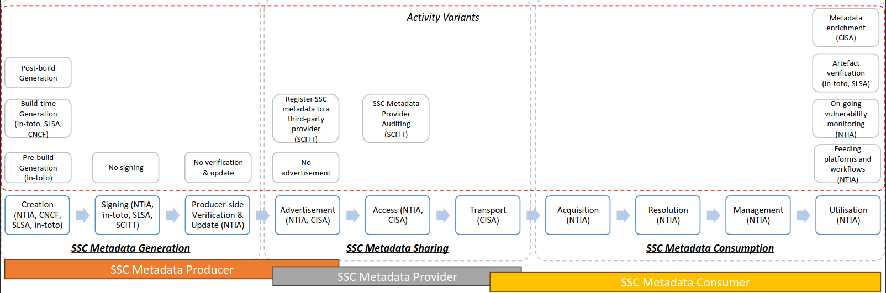

This article series delve into what SSC metadata entails and explore how to establish a suite of software tools to manage them effectively. The content presented here draws from recent research conducted by myself and colleagues at CREST. For more comprehensive information and details regarding the methodology, please refer to the preprint associated with this work.

In the previous part, we talked about what SSC metadata and how it can help you. In this part, we talk about the actors and activities across the life cycle of SSC metadata. 

# Who involve in the life cycle of SSC metadata?

Several crucial roles come into play, each with specific responsibilities. These roles can be categorized into three main types.

**SSC Metadata Producers: Crafting Trustworthy Metadata** - SSC Metadata Producers are the ones who create SSC metadata documents. These producers can be project owners or package creators who define the intended supply chain of a software artefact (e.g., where its source code is located, who has the right to develop and build it, what its build instructions are). 

Additionally, developers and build systems, who manage individual steps in a software artifact's lifecycle, can also create SSC metadata regarding their activity. For instance, a build system can generate and sign SBOMs of the artefacts that they build. 

**SSC Metadata Consumers: Harnessing Metadata's Power** - On the other side, SSC Metadata Consumers retrieve and utilize SSC metadata. Among them, *verifiers* play a pivotal role, leveraging SSC metadata to ensure the authenticity and integrity of software artifacts. The verification process generates additional metadata, such as VEX, enriching the understanding of these artifacts. Other essential consumer types include *insurers* and *auditors*, who employ SSC metadata for assessing organizations, be it for regulatory compliance or insurance evaluation.

**SSC Metadata Providers: Bridging the Gap with Trustworthy Intermediaries** - Operating as intermediaries, SSC Metadata Providers serve as vital bridges between metadata producers and consumers. Not only do they facilitate the seamless flow of metadata, but they can also act as notaries, validating the existence and accuracy of SSC metadata documents registered by producers.

# Life cycle of SSC Metadata

The SSC metadata lifecycle consists of ten key activities, which can be grouped into three phases: generation, sharing, and consumption.

The **Generation Phase** consists of three activities:
1. **Metadata Creation:** This involves generating various types of metadata, such as SBOM, provenance, attestation, and VEX, using manual or automated tools. 
2. **Metadata Signing:** Some frameworks, like in-toto and SCITT, require digitally signing SSC metadata. SLSA 1.0RC also mandates this in its second and third build levels. However, signing is not always mandatory.
3. **Verification and Updating:** This activity, introduced in NTIA's supplier playbook, aims to rectify potential errors in SBOM creation. Provider-side verification and update aren't prevalent in other frameworks.

The **Sharing Phase** connects metadata producers and consumers. It encompasses:
1. **Advertisement:** Producers inform consumers about the availability of SSC metadata documents and updates. They may handle this directly or use third-party providers. Alternatively, producers can omit the advertisement, requiring consumers to query for metadata.
2. **Access:** Consumer requests for SSC metadata are authorized based on specified policies, either by producers or providers. Provider auditing may come into play if a third-party provider is used.
3. **Transport:** Secure mechanisms are employed to transfer SSC metadata documents from producers or providers to authorized consumers. The transfer can be from a single point to a single point or to multiple points, depending on the audience.

The **Consumption Phase** involves four activities:
1. **Acquisition:** Consumers obtain SSC metadata documents through sharing mechanisms provided by producers or providers.
2. **Resolution:** Consumers map the statements in SSC metadata documents to software artifacts within their inventory, establishing connections.
3. **Content Management:** Policies related to storage, data retention, and lifecycle management of SSC metadata documents are defined and enforced.
4. **Utilization:** The acquired SSC metadata documents are integrated into various workflows or platforms for purposes like vulnerability monitoring and artifact verification. Organizations may enrich acquired documents and share them with others.

_____
That's all for the part two of this series. In the next article, we will talk about the architecture of a software stack for carrying out the identified life cycle activities.