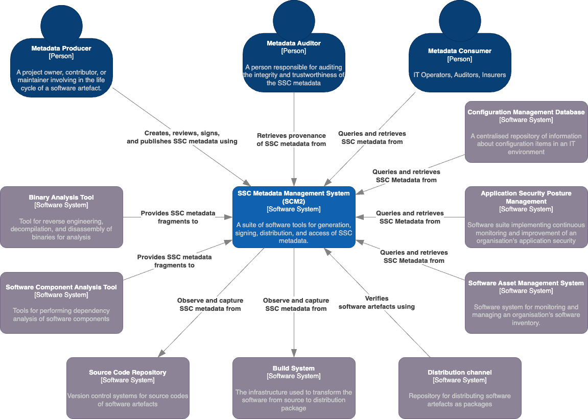
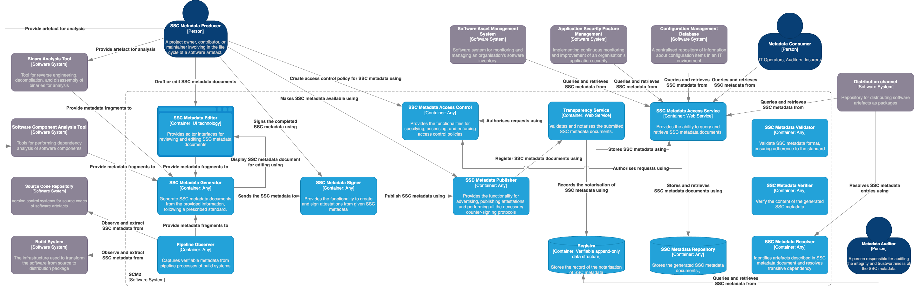

This article series delve into what SSC metadata entails and explore how to establish a suite of software tools to manage them effectively. The content presented here draws from recent research conducted by myself and colleagues at CREST. For more comprehensive information and details regarding the methodology, please refer to the preprint associated with this work.

In the previous part, we talked about SSC metadata and its life cycle. In this part, we talk about the architecture of a software stack that help you carry out life cycle activities of SSC metadata. 

# System context

The **SSC Metadata Management System (SCM2)** is a suite of tools designed for managing the life cycle of SSC metadata, ensuring the integrity and security of software artifacts. The system context diagram below provides insight into SCM2's positioning and scope. SCM2 interfaces with various actors and systems, categorized into producers and consumers.

**Producers:** SCM2 interacts with metadata producers, including binary analysis tools, software component analysis tools (SCA), source code repositories, and build systems. These actors push or pull SSC metadata fragments into SCM2, facilitating the creation of comprehensive SSC metadata documents. SCM2's generation process can be automated within CI/CD pipelines or initiated manually by producers, accommodating diverse organizational needs.

From SCM2's perspective, the first three are considered push-based producers, pushing SSC metadata fragments to SCM2 for constructing SSC metadata documents. In contrast, source code repositories and build systems are pull-based producers, with SCM2 observing and pulling metadata fragments from these systems as needed.

**Consumers:** On the consumption side, SCM2 serves metadata consumers, configuration management databases, application security posture management systems, software asset management systems, distribution channels, and metadata auditors. These entities access SCM2 to retrieve SSC metadata documents, ensuring the authenticity of incoming software artifacts. Metadata auditors use SCM2's provenance data to assess the reliability of both the SSC metadata and SCM2 itself.

**SSC metadata generation process:**
- The process can be triggered by the build process, commonly integrated into CI/CD pipelines. This approach suits scenarios where the software artifact's producer is also its developer and project owner.
- Alternatively, SSC metadata generation can be initiated manually by the producer when the need arises, such as for documenting software inventory with SBOM documents. This is more relevant to organizations primarily consuming software artifacts. Producers may use SCA and binary analysis tools to extract necessary information. SCM2 focuses on generating SSC metadata documents from these tools' outputs, without performing composition analysis or reverse engineering binaries. 

# System components

The figure above explores the distribution of functionality within SCM2, divided into 13 containers. Note that in this context, a "container" refers to a separately runnable unit for code execution or data storage, rather than a software container like Docker. We organize these containers into five groups, each aligned with a phase of the SSC metadata lifecycle that they manage.

**SSC Metadata Generation Group:**
1. *SSC Metadata Editor*: This container provides a user-friendly interface for reviewing and editing SSC metadata documents, supporting producers in authoring metadata, supplying post-build metadata, and verifying auto-generated SSC metadata documents.
2. *Pipeline Observer*: It captures crucial data about tasks in a build pipeline, such as source code retrieval, dependencies, and testing, which serve as input for SSC metadata generation.
3. *SSC Metadata Generator*: This container creates SSC metadata documents from input information, following prescribed standards like SPDX. While many tools combine this function with Software Composition Analysis or a pipeline observer, SCM2 keeps them separate for clarity and flexibility.

**SSC Metadata Signing Group:**
- *SSC Metadata Signer*: This container empowers metadata producers to sign SSC metadata documents, effectively transforming them into authenticated statements about software artifacts, known as software attestations.

**SSC Metadata Publishing Group:**
1. *SSC Metadata Publisher*: It offers functionality for publishing and advertising generated SSC metadata documents, following the "advertisement" phase in the SBOM sharing lifecycle. It can also implement notarization workflows, as described in the SCITT architecture.
2. *SSC Metadata Access Control*: This container handles access control policies for published SSC metadata documents and authorizes requests, aligning with the requirements outlined in the SBOM sharing lifecycle.

**SSC Metadata Sharing Group:**
1. *SSC Metadata Repository*: This container stores the generated SSC metadata documents, akin to the "artefact repository" in the Secure Software Factory reference architecture.
2. *SSC Metadata Access Service*: Acting as a wrapper around the metadata repository, this container enables metadata consumers and external systems to query and retrieve SSC metadata documents, aligning with the "access" and "transport" phases in the SBOM sharing lifecycle.
3. *Registry*: Serving as a verifiable, append-only data store for notarization records of SSC metadata documents, this container complies with the SCITT architecture. An example of this is the public instance of Rekor.
4. *Transparency Service*: This container validates and notarizes submitted SSC metadata documents and records the process in the registry, in line with the SCITT architecture.

**SSC Metadata Consumption Group:**
1. *SSC Metadata Validator*: Providing syntax validation for SSC metadata documents to ensure compliance with specific standards, this component is introduced by NTIA.
2. *SSC Metadata Verifier*: Offering the capability to verify information within SSC metadata documents, this component is also introduced by NTIA.
3. *SSC Metadata Resolver*: Implementing the resolution step introduced by NTIA, this container identifies and resolves artefacts described in SSC metadata documents, addressing transitive dependencies.

_____
That's all for the part three of this series. In the next article, we will talk about the state of the current technologies related to SCM2. 