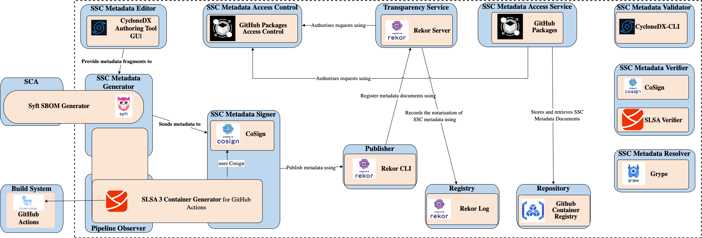

This article series delve into what SSC metadata entails and explore how to establish a suite of software tools to manage them effectively. The content presented here draws from recent research conducted by myself and colleagues at CREST. For more comprehensive information and details regarding the methodology, please refer to the preprint associated with this work.

In the previous part, we talked about the architecture of a software stack called SCM2 for operating SSC metadata. In this part, we talk about some existing technologies that you can use to implement this software stack. 

# How SSC security tools support SSC metadata

**Scribe Platform:** [Scribe](https://scribesecurity.com/scribe-platform/) is a versatile tool that assists software producers and consumers in managing supply chain risks. It helps generate critical evidence, such as SBOMs, to demonstrate software safety and compliance. Scribe can integrate with popular build systems like GitHub Actions and Jenkins, acting as a pipeline observer. Additionally, it supports the generation of SSC metadata from container images, leveraging Docker's BuildKit for SBOM generation. Scribe cancreate SBOMs in CycloneDX format and SLSA-compliant provenance statements, with the added capability of generating VeX for enriched SBOMs. When it comes to signing, Scribe supports in-toto attestation through the `cosign` tool from the `sigstore` toolkit. Furthermore, it facilitates SSC metadata countersigning using `Rekor` from the `sigstore` toolkit. Scribe offers flexible options for SSC metadata storage and distribution, including cloud storage services and locally deployed OCI-based container registries. It implements a Pub/Sub protocol for efficient advertisement and access control of SSC metadata. On the consumer side, Scribe provides tools for verifying software attestations, ensuring the integrity of your software supply chain.

**Chainguard Enforce Platform:** The [Chainguard Enforce](https://www.chainguard.dev/chainguard-enforce) platform specializes in SSC security, focusing primarily on container workloads. Operating within a Kubernetes cluster, it continuously monitors SSC metadata within container images to enforce user-defined policies rigorously. While Chainguard Enforce excels in SBOM consumption for policy enforcement, it also has the ability to generate SBOMs in SPDX and CycloneDX formats for container images without associated SBOMs, leveraging the open-source SCA tool, [Syft](https://github.com/anchore/syft). It's important to note that Chainguard Enforce does not extract SSC metadata fragments from build systems, and therefore, it does not include a pipeline observer. The platform relies on an OCI-based container registry for both containers and associated SBOMs. Producers notify the existence of SBOMs through invitations and access is managed via an Identify and Access Management (IAM) model. Similar to Scribe, Chainguard Enforce utilizes `cosign` and `rekor` from the `sigstore` suite for signing, registry, and transparency services. `cosign` is also employed for verifying container image signatures.

**Anchore Platform:** [Anchore](https://anchore.com/opensource/) is an SCM2 solution primarily focusing on generating and consuming SBOMs for container images. Anchore revolves around two open-source tools: [Syft](https://github.com/anchore/syft) for generating SBOMs and [Grype](https://github.com/anchore/grype) for vulnerability scanning via SBOM consumption. Unlike the previous platforms, Anchore does not include a pipeline observer as it does not capture build pipeline tasks. Instead, it triggers SBOM generation and vulnerability analysis upon commits. Anchore employs PostgreSQL as its data store, offering flexibility with on-prem databases or integration with external services like Amazon RDS. Notably, Anchore does not provide specific support for SSC metadata signing, notarization, or verification.

**Snyk Platform:** [Snyk](https://snyk.io/) is a developer security platform known for its comprehensive vulnerability detection capabilities throughout the software development life cycle. Snyk has expanded its features to include the generation of SBOMs (Software Bill of Materials) for external use. With Snyk, you can create SBOMs in SPDX and CycloneDX formats. The process of viewing the generated SBOMs is facilitated through a REST API accessible via the command line tool `curl` or the Snyk CLI. At the time of writing this article, Snyk does not currently provide specific support for signing, notarization, or verification of SSC (Software Supply Chain) metadata.

**FOSSA Platform:** [FOSSA](https://fossa.com/) is an open-source management platform designed to enhance visibility into the licensing and vulnerability aspects of open-source dependencies within a software inventory. FOSSA can generate SBOMs in SPDX and CycloneDX formats, primarily by leveraging Software Composition Analysis (SCA) tools to contribute essential data to the SBOM creation process. In the Software as a Service (SaaS) mode, FOSSA stores SBOMs in cloud-based storage, functioning as a repository for SSC metadata. Producers can share access links to the generated SBOMs with consumers. Similar to Snyk, FOSSA does not currently offer specific features for SSC metadata signing, notarization, or verification.

# Putting together an SCM2 system

Using a selection of open-source tools, we've crafted a comprehensive SCM2 configuration to manage all three types of SSC metadata (SBOM, Provenance, and Attestation). This configuration covers the entire life cycle, starting with a software supplier committing their source code to a Version Control System (VCS). From there, the code is processed through a CI/CD build pipeline to generate a container image. The resulting image, along with associated SSC metadata, is then published to a Container Image Registry. The figure below illustrates how the various SCM2 containers are linked to open-source tools and technologies in this setup.

_____
That's all for the part four of this series. If you want more details about the presented architecture or the underlying methodology, please refer to the preprint associated with this work or leave a message!  