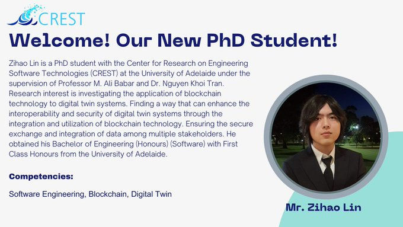

🎉Welcome Zihao Lin to the CREST family!

Zihao joins [#CREST](https://twitter.com/hashtag/CREST?src=hashtag_click) as a Ph.D. student to explore security & interoperability of [#DigitalTwins](https://twitter.com/hashtag/DigitalTwins?src=hashtag_click), supervised by Dr. Nguyen Khoi Tran & Prof. Ali Babar.

!🌟We look forward to working with him!

[@nktrandlt](https://twitter.com/nktrandlt)

[@alibabar](https://twitter.com/alibabar)

