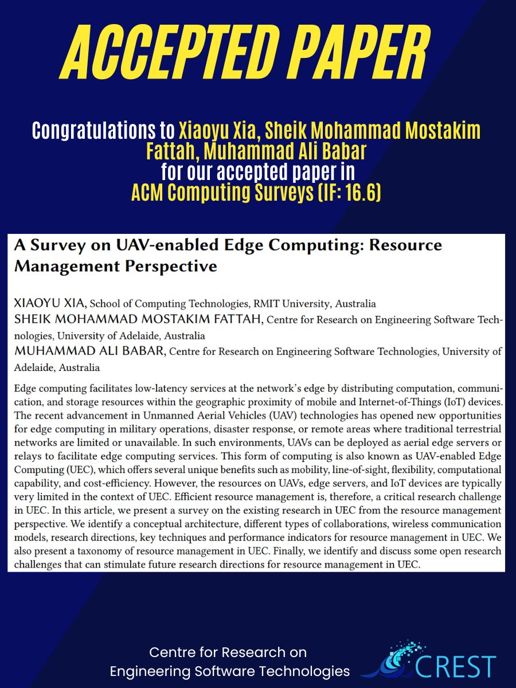

🎉New Paper Accepted !

Thrilled to share that the paper titled "A Survey on UAV-enabled Edge Computing: Resource Management Perspective” by Dr.Xiaoyu XIA, Dr.Sheik Mohammad Mostakim Fattah and Prof. Ali Babar has achieved acceptance in [#ACMComputingSurveys](https://twitter.com/hashtag/ACMComputingSurveys?src=hashtag_click) [#EdgeComputing](https://twitter.com/hashtag/EdgeComputing?src=hashtag_click)

