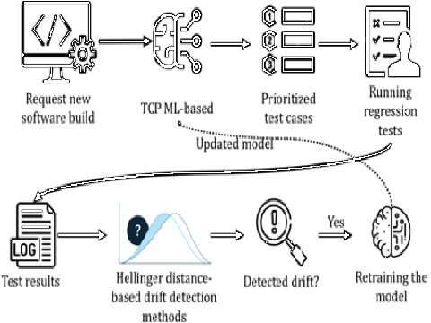

#### Maintaining ML4CI test case prioritization models through using data drift detection

Machine Learning (ML) is increasingly used to automate activities like Test Case Prioritization (TCP) in Continuous Integration (CI). However, ML models lose accuracy due to data drift caused by changes in the CI environment. Retraining ML models regularly is time-consuming and labour-intensive. Therefore, it is crucial to find approaches that can reduce retraining efforts and time for ML models used in CI environments. This project investigates using data drift detection techniques to automatically detect retraining points for ML models without requiring detailed knowledge of software projects.

We employed the Hellinger distance to detect drift points in input data values and distribution. These points were utilized as retraining points for the ML model. We evaluated the effectiveness of this method on multiple datasets and compared it with regularly retrained models using statistical methods. Our experimental evaluation demonstrated that the Hellinger distance-based method effectively and efficiently detects retraining points, leading to reduced maintenance costs for the State-of-the-art test case prioritization method. The proposed method in this study is valuable for practitioners without specialized knowledge of software projects, enabling them to maintain ML model accuracy.

---

**Publications**

1. [Sok: Machine learning for continuous integration](https://ieeexplore.ieee.org/abstract/document/10189045/)
2. [Systematic Literature Review on Application of Machine Learning in Continuous Integration](https://arxiv.org/abs/2305.12695)
3. [Mitigating ML Model Decay in Continuous Integration with Data Drift Detection: An Empirical Study](https://arxiv.org/abs/2305.12736)

---

**Project Members**

1. Ali Kazemi Arani
2. Triet Le