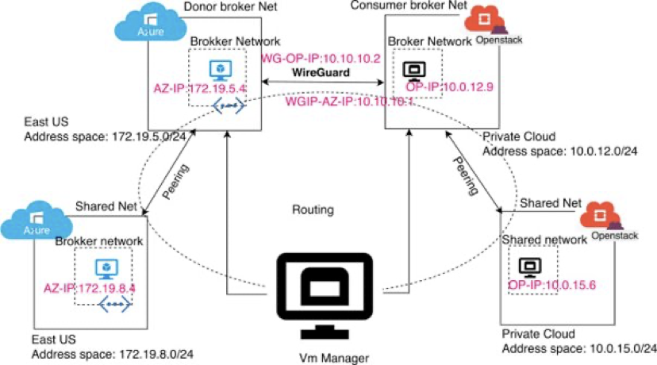

#### Performance evaluation of Big Data Analytical frameworks in hybrid clouds

In the vast realm of cloud computing, powerhouses like Hadoop, Spark, and Flink are leading the charge. These distributed data processing frameworks are like orchestrators, seamlessly distributing data among computing nodes. While we've seen studies evaluating their performance in private and public clouds, the hybrid cloud—a fusion of private and public clouds—has been relatively uncharted territory. That's where we come in. We've taken on the challenge to assess how Hadoop, Spark, and Flink perform in this hybrid frontier, focusing on crucial metrics like execution time, resource use, scalability, and cost.

In this project, a dynamic duo featuring OpenStack (representing the private cloud) and the mighty MS Azure (holding the flag for the public cloud) [1]. We've thrown different workloads at it, from batch to iterative processes, to truly test the waters. Here's what we've uncovered in this hybrid cloud adventure: (i) as the private cloud borrows more nodes from the public cloud, execution time ticks up, (ii) Flink steals the spotlight by outpacing Spark, which, in turn, outshines Hadoop in execution speed, (iii) Hadoop becomes the data juggler, while Spark keeps it minimal, (iv) when it comes to scaling, horizontal is the way to go for all three, and (v) Spark emerges as the budget-friendly champion for data processing, while Hadoop demands a hefty price tag. Now, let's put this in perspective for game-changing applications. Imagine these cutting-edge frameworks—Hadoop, Spark, and Flink—transforming the landscape of healthcare and the agrifood industry. By boosting data analysis speed, optimizing resource usage, and slashing costs in hybrid cloud environments, these frameworks become catalysts for progress in these critical sectors.

---

**Publications**

1. [An automated implementation of hybrid cloud for performance evaluation of distributed databases](https://scholar.google.com.au/citations?view_op=view_citation&hl=en&user=VPjDr3AAAAAJ&citation_for_view=VPjDr3AAAAAJ:0EnyYjriUFMC) 
2. [Evaluation of Distributed Data Processing Frameworks in Hybrid Clouds](https://scholar.google.com.au/citations?view_op=view_citation&hl=en&user=4dB2Py0AAAAJ&citation_for_view=4dB2Py0AAAAJ:HDshCWvjkbEC)

---

**Project Members**

1. Shagun Dhingra
2. Yaser Mansouri
3. Faheem Ullah
4. Xiaoyu Xia