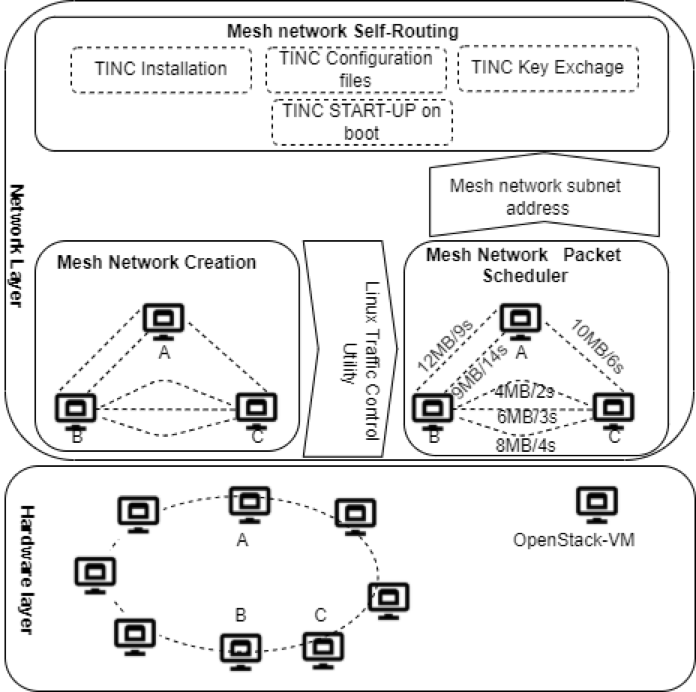

#### Design and Implementation of Fragmented Clouds for Evaluation of Distributed Databases & Big Data Analytical frameworks

Description: Introducing the Fragmented Hybrid Cloud (FHC), a revolutionary infrastructure that offers a cohesive view of multiple dispersed private cloud datacenters. FHC operates on a novel fragmented usage model, facilitating bi-directional resource outsourcing across private clouds hosted by both static and mobile entities. The mobility of private cloud nodes plays a pivotal role in shaping FHC performance, affecting latency and network throughput inversely relative to dynamically changing distances between nodes. This mobility also introduces intermittent disruptions among computing nodes and network links within the FHC infrastructure.

To effectively address mobility and its implications, we designed a layered FHC system utilizing Linux utilities and bash-shell programming. Extensive evaluations were conducted to understand the impact of node mobility on the performance of distributed databases. Notably, time-varying latency and bandwidth, cluster node resizing, and network accessibility were assessed. These meticulous experiments shed light on the performance dynamics of major big data databases—Cassandra, MongoDB, Redis, and MySQL—when deployed in the context of the FHC framework.

---

**Project Members**

1. Shagun Dhingra
2. Yaser Mansouri
3. Faheem Ullah